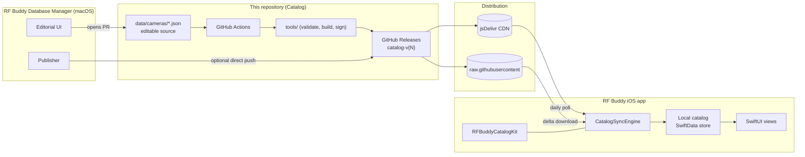
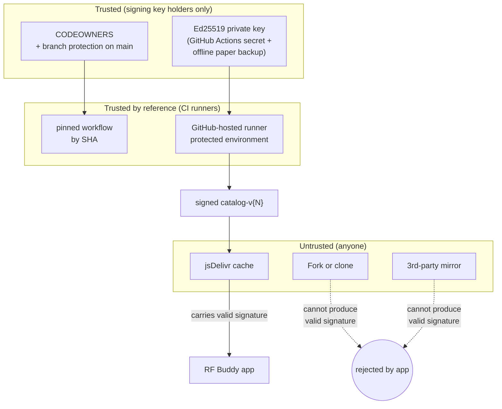
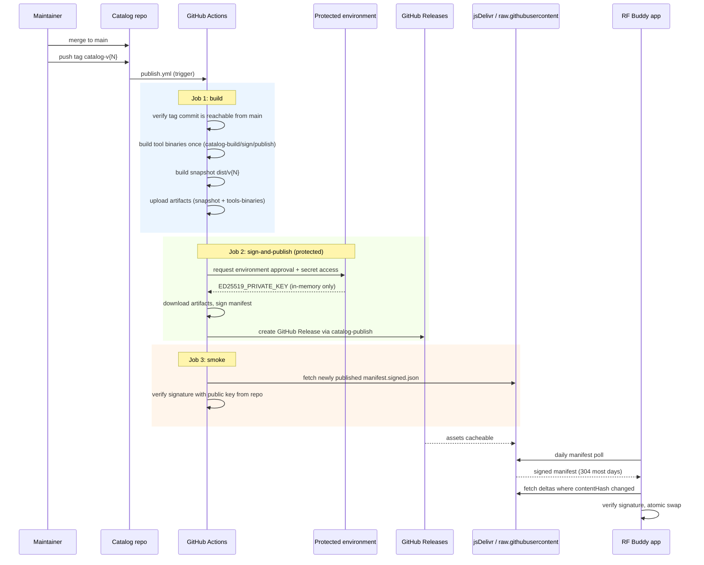

# Catalog — Architecture

> **Audience:** maintainers and AI agents working in this repository.
> **Companion documents:** [`README.md`](README.md), [`IMPLEMENTATION_PLAN.md`](IMPLEMENTATION_PLAN.md).
> **Upstream consumer:** the RF Buddy iOS/iPadOS app and its
> `RFBuddyCatalogKit` Swift package. The consumer-side design is
> documented in the RF Buddy repository at `docs/ONLINE_CATALOG_PLAN.md`
> and is **the authoritative reference for wire format, signing, and
> sync semantics**. This document describes the producer side only.

---

## 1. Purpose in the context of RF Buddy

RF Buddy is an iOS and iPadOS application that turns a tablet or phone
screen into a calibrated optical bench for **vintage rangefinder
cameras built between roughly 1935 and 1970**. To compute a meaningful
calibration target the app needs two physical optical parameters per
camera model:

- **Baseline** — the distance, in millimetres, between the centres of
  the two rangefinder windows.
- **Viewfinder magnification** — a dimensionless ratio of apparent to
  real angular size in the viewfinder.

The product of those two values, called the *effective baseline*, is
the dominant factor in how precisely a rangefinder can resolve focus.
Hundreds of camera models exist; almost none have manufacturer-published
values in modern, accessible sources. Assembling and maintaining a
trustworthy table of those values is a research effort distinct from
building the app, and it benefits from a separate workflow with
editorial review, citations, and version history.

**This repository is that table.** It exists so that:

1. The RF Buddy app can ship with a complete, immediately usable camera
   database on first install, without any network call.
2. New camera models and corrected measurements can reach existing
   users without an App Store update.
3. Every value in the database is backed by a citation that survives
   schema migrations and can be audited by users and contributors.
4. The editorial workflow has proper version control, code review, and
   continuous validation independent of the app's release cycle.

---

## 2. Where this repo sits in the larger system



The repo's only job is to **emit signed, immutable catalog releases**.
Everything past the GitHub Release boundary is consumer territory.

---

## 3. Intent and scope of the catalog architecture

### 3.1 Intent

| Intent | What it means concretely |
|--------|--------------------------|
| Single source of truth | No camera optical data is hand-maintained anywhere except `data/cameras/*.json` in this repo |
| Trust at rest | Every published manifest is Ed25519-signed by an offline-held key; the app refuses to apply unsigned bundles |
| Trust in transit | TLS to GitHub + jsDelivr; signature is the real defense, transport is belt-and-suspenders |
| Cheap freshness | Daily polls hit a 304-cached manifest; per-model SHA-256 hashes mean we only download what changed |
| Cheap rollback | Each release is an immutable Git tag + GitHub Release; reverting is "point the latest pointer at an older tag" |
| Editorial discipline | All changes flow through pull requests with schema validation; nothing gets to users without CI passing |
| Provider-agnostic consumer | The consumer only sees a `CatalogRemote` protocol; this repo happens to be the GitHub conformance |

### 3.2 Scope (in)

- Camera metadata: manufacturer, model, classifiers, build years, RF
  coupling kind, format.
- Optical measurements: baseline (mm), magnification (dimensionless),
  with optional precision and free-text notes.
- Bibliographic sources per measurement (title, author, year, type,
  URL or citation, authority tier 1–5).
- The signed manifest binding all of the above to a monotonically
  increasing revision number.
- Tooling that validates, canonicalises, builds, signs, and publishes
  the snapshot.

### 3.3 Scope (out)

- User-specific data of any kind. Calibration sessions, user notes,
  user-added cameras live exclusively in the user's iCloud private
  database via SwiftData and never touch this repo.
- Photographs, manuals, or copyrighted material. Citations link out to
  external sources; we do not host them.
- Localised display strings. The app translates labels; the catalog is
  language-neutral data.
- Runtime endpoints / dynamic features. The catalog is static signed
  blobs, not an API.

### 3.4 Trust boundary diagram



Two practical consequences:

- **Public fork ≠ supply-chain risk.** A fork can be cloned, modified,
  and re-tagged, but cannot produce a signature the app will accept.
- **CDN compromise ≠ attack vector.** A malicious cache that returns
  the wrong bytes fails signature verification on the device and is
  rejected with no user-visible state change.

---

## 4. Repository layout

```
Catalog/
├── README.md
├── LICENSE-data        # CC BY-SA 4.0
├── LICENSE-code        # MIT
├── CODEOWNERS
├── catalog.config.yml  # single source of repo identity (see §6)
├── data/
│   ├── manifest.template.json
│   └── cameras/
│       ├── 7f2a1b3c-0001-4e8d-9f0a-1b2c3d4e5f01.json   # Agfa Isolette III
│       ├── 7f2a1b3c-0002-4e8d-9f0a-1b2c3d4e5f02.json   # Agfa Super Solinette
│       └── ...                                           # one file per model, named by UUID
├── tools/
│   ├── Package.swift                # Swift CLI tools, CommandLineKit
│   └── Sources/
│       ├── catalog-validate/        # JSON schema + cross-field rules
│       ├── catalog-build/           # canonicalise + assemble manifest
│       ├── catalog-sign/            # Ed25519 signature
│       └── catalog-publish/         # GitHub Releases via gh CLI
├── schema/
│   ├── camera.schema.json           # JSON Schema 2020-12 for one model
│   └── manifest.schema.json
├── .github/
│   ├── workflows/
│   │   ├── pr-validate.yml          # runs on every PR
│   │   ├── publish.yml              # runs on tag push catalog-v*
│   │   └── weekly-health.yml        # link-rot + signature freshness
│   ├── ISSUE_TEMPLATE/
│   │   └── new-camera-model.md
│   ├── pull_request_template.md
│   └── dependabot.yml
└── docs/
    ├── ARCHITECTURE.md              # this file
    ├── IMPLEMENTATION_PLAN.md
    ├── HANDOVER_TO_RF_BUDDY.md      # generated by milestone M9
    └── DECISIONS/                   # ADRs, optional
```

The **per-model JSON file** is the editorial atom. It mirrors the wire
format the app already understands, plus a `schemaVersion` field so the
publisher can refuse to release mismatched files.

---

## 5. Wire format (summary)

The on-disk per-model file follows the schema produced by RF Buddy's
existing `cameras.json` research workstream. A single record:

```json
{
  "schemaVersion": 1,
  "id": "7f2a1b3c-0001-4e8d-9f0a-1b2c3d4e5f01",
  "createdAt": "2026-04-21",
  "manufacturer": "Agfa",
  "model": "Isolette III",
  "classifiers": "Uncoupled rangefinder. ...",
  "yearOfBuild": { "from": 1951, "to": 1960 },
  "rfCoupling": "uncoupled",
  "format": "6x6 on 120",
  "baseLength": {
    "value": null,
    "unit": "mm",
    "sources": [],
    "ranking": 0,
    "note": "Physical measurement required."
  },
  "magnification": {
    "value": null,
    "sources": [],
    "ranking": 0,
    "note": "Not documented."
  },
  "userAnnotation": null
}
```

The **manifest** is the assembled, signed top-level document the app
fetches. It lists every model file in this revision, with size and
content hash:

```json
{
  "schemaVersion": 1,
  "revision": { "number": 17, "publishedAt": "2026-05-12T10:00:00Z" },
  "modelCount": 250,
  "totalBytes": 250023411,
  "entries": [
    {
      "id": "7f2a1b3c-0001-4e8d-9f0a-1b2c3d4e5f01",
      "revisionAdded": 1,
      "revisionUpdated": 12,
      "contentHash": "sha256-…",
      "bytes": 1024,
      "path": "cameras/7f2a1b3c-0001-…json"
    }
  ],
  "signerKeyID": "rf-buddy-catalog-2026-04",
  "signature": "ed25519-…"
}
```

The signature covers the canonical-JSON encoding of the manifest with
the `signature` field elided. The full canonicalisation rules live in
`schema/manifest.schema.json` and `tools/Sources/catalog-build/`.

---

## 6. Publishing pipeline implementation and optimizations

The release pipeline is implemented in `.github/workflows/publish.yml`
and is intentionally split into three jobs with strict handoff between
them.



### 6.1 Trigger and orchestration

- Trigger: push of tag `catalog-v*`.
- Concurrency guard: one workflow per ref (`publish-${github.ref}`),
  with no in-progress cancellation for the same ref.
- Revision derivation: `{N}` is parsed from the tag name and carried as
  an output from the `build` job to downstream jobs.

### 6.2 Job 1: build (no secrets)

Responsibilities:

1. Checkout source and verify that the tagged commit is an ancestor of
   `main` (prevents off-branch releases).
2. Install Swift toolchain for CI.
3. Compile release binaries for:
   - `catalog-build`
   - `catalog-sign`
   - `catalog-publish`
4. Build the catalog snapshot (`dist/v{N}`) using `catalog-build`.
5. Upload two artifacts:
   - `snapshot` (manifest + per-model files)
   - `tools-binaries` (compiled Swift executables)

Security and efficiency intent:

- No signing key is available in this job.
- Compilation is done once here to avoid repeating expensive Swift
  builds in downstream jobs.

### 6.3 Job 2: sign-and-publish (protected environment)

Responsibilities:

1. Wait for required environment approval (`production`).
2. Download `snapshot` and `tools-binaries` artifacts.
3. Mark downloaded binaries executable (artifact mode preservation is
   not guaranteed across platforms).
4. Sign `manifest.json` into `manifest.signed.json` using
   `ED25519_PRIVATE_KEY`.
5. Generate build provenance attestation for the signed manifest.
6. Publish release assets by executing `catalog-publish`.

Implementation details:

- `catalog-publish` shells out to GitHub CLI (`gh`) on the runner.
- Release notes are optional and included only when
  `CHANGELOG.fragment.md` exists.
- Job permissions are minimal for purpose:
  - `contents: write` (release creation)
  - `attestations: write` (persist build provenance)
  - `id-token: write` (attestation / future signing workflows)

### 6.4 Job 3: smoke (post-publish verification)

Responsibilities:

1. Download `tools-binaries` artifact and mark binaries executable.
2. Wait briefly for release propagation.
3. Fetch `manifest.signed.json` from the published release URL.
4. Resolve the active public key id from `catalog.config.yml` and
   verify signature with repository-pinned public key material.

This validates that what is publicly retrievable is also verifiable by
the same trust anchors used by the consumer.

### 6.5 Optimizations currently in place

The pipeline is optimized for free-tier minute usage without reducing
integrity checks:

- Single compile pass per workflow run:
  tool binaries are built once in `build`, then reused.
- Artifact-based handoff:
  downstream jobs consume compiled binaries instead of running
  `swift run` (which would compile again).
- Secret minimization:
  only `sign-and-publish` touches `ED25519_PRIVATE_KEY`.
- Failure containment:
  smoke verification runs after publish and fails the workflow if
  public retrieval or signature verification is broken.
- Deterministic release path:
  release creation is centralized in `catalog-publish` so command logic
  does not diverge between local tests and CI.

#### Cost profile (cold vs warm runs)

The table below gives practical expectations for the `publish.yml`
workflow on GitHub-hosted `ubuntu-latest` runners.

| Stage | Typical cold run | Typical warm run | Minute driver |
|------|-------------------|------------------|---------------|
| Job 1: build | ~3-6 min | ~2-4 min | SwiftPM dependency resolution + release compilation + snapshot build |
| Job 2: sign-and-publish | ~1-3 min | ~1-2 min | Artifact download, manifest signing, release upload |
| Job 3: smoke | ~1-2 min | ~1-2 min | CDN wait + fetch + signature verification |
| Manual approval wait (environment gate) | variable | variable | Human latency (not runner CPU-bound work) |

Interpretation:

- **Cold run** means dependency fetch and initial compilation are paid in
  this workflow run.
- **Warm run** means dependencies/toolchain state are effectively hot
  and artifact reuse avoids repeat compilation in downstream jobs.
- The largest billable slice is almost always **Job 1 build**; that is
  why single-pass compile plus artifact fan-out is the primary
  optimization in this architecture.

### 6.6 Optional future optimization: cross-run caching

Cross-run caching for SwiftPM dependencies and build outputs is not
currently required for correctness. It can reduce minutes further, but
it introduces cache-key design and invalidation complexity. If adopted,
cache keys should include at minimum:

- OS and Swift version
- `tools/Package.resolved`
- hashes of `tools/Sources/**` and `tools/Package.swift`

This preserves correctness while improving warm-run latency.

Two important properties remain unchanged:

- **The signing key never leaves the protected environment.** It is
  injected as an environment-scoped secret, used in-memory by the
  signer step, and never persisted to disk. The runner is destroyed
  after the job.
- **Published release assets are immutable by policy.** Tag rulesets
  prevent updates/deletions for `catalog-v*` tags, preserving release
  integrity for consumer fetches.

---

## 7. What this architecture does *not* do

- It does not run a server. There is no per-request authentication, no
  rate limiting, no observability beyond Actions logs. Static signed
  blobs are the entire surface.
- It does not push. The app pulls. There is no notification path from
  this repo to user devices; the daily background poll is the
  communication channel.
- It does not version the schema implicitly. Every per-model file
  carries `schemaVersion`; bumping it is an explicit decision with a
  matching consumer-side migration.
- It does not store user-contributed data. Anyone who wants to suggest
  a measurement opens a pull request with their citation; the
  maintainer reviews and accepts.

---

## 8. Why this shape, summarised

1. **GitHub Releases + a CDN** is the cheapest, most operationally boring
   way to ship signed static assets to ~100 daily clients.
2. **Per-model files** keep diffs small, code review human-readable,
   and per-entry blame trivial.
3. **A signed manifest** is the only thing the consumer must trust; this
   reduces the attack surface to a single Ed25519 verification call.
4. **A tiny Swift CLI** in `tools/` keeps the producer code in the same
   language as the consumer code (and the same language as the
   maintainer's macOS Database Manager app), so all parties share
   canonicalisation logic and DTOs.
5. **GitHub Actions does the publish** so the maintainer's only manual
   action is approving a PR and pushing a tag — no laptop with the
   signing key is required for routine releases (the offline paper
   backup exists for disaster recovery only).
