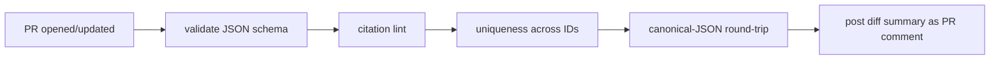
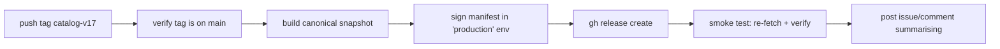
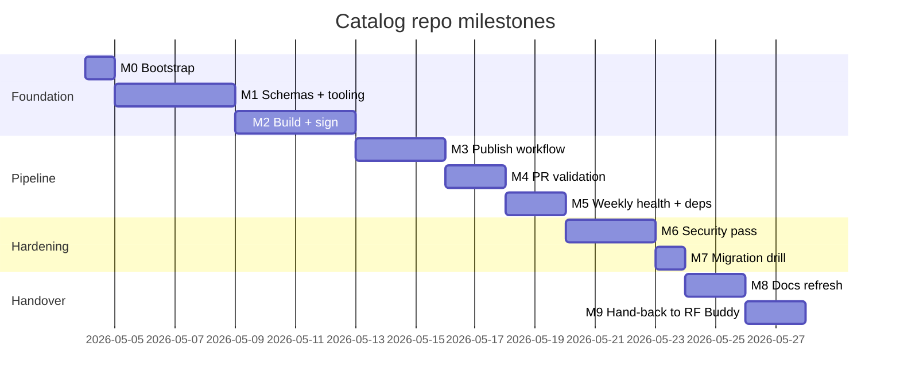

# Catalog — Implementation Plan

> **Audience:** AI agents and human engineers configuring this repository
> from scratch.
> **Purpose:** stand up the Catalog repo end-to-end, ship its first signed
> release, and produce a hand-back document for the upstream RF Buddy
> project.
> **Companion documents:** [`README.md`](README.md), [`ARCHITECTURE.md`](ARCHITECTURE.md).
> **Authoritative consumer-side reference:** the RF Buddy repository at
> `docs/ONLINE_CATALOG_PLAN.md`.
> **Initial repository URL:** `https://github.com/sobchak-security/Catalog.git`
> (configurable — see §2).

---

## Table of contents

1. [Goals and constraints](#1-goals-and-constraints)
2. [Configurable repository identity](#2-configurable-repository-identity)
3. [GitHub repository configuration on the free tier](#3-github-repository-configuration-on-the-free-tier)
4. [CI/CD pipeline](#4-cicd-pipeline)
5. [Security hardening](#5-security-hardening)
6. [Free-tier usage envelope](#6-free-tier-usage-envelope)
7. [Operational runbook](#7-operational-runbook)
8. [Milestones — actionable for an AI agent](#8-milestones--actionable-for-an-ai-agent)
9. [Appendix A — sample workflow files](#appendix-a--sample-workflow-files)
10. [Appendix B — sample CODEOWNERS, branch ruleset, and templates](#appendix-b--sample-codeowners-branch-ruleset-and-templates)

---

## 1. Goals and constraints

### Goals

1. Stand up `https://github.com/sobchak-security/Catalog.git` as a
   producing repository with the structure described in
   [`ARCHITECTURE.md`](ARCHITECTURE.md) §4.
2. Configure the repository to be **as restrictive as the GitHub Free
   tier permits** while still allowing the RF Buddy app to fetch
   releases without authentication.
3. Build a CI/CD pipeline that validates every pull request, signs and
   publishes on tag, and runs a weekly health check.
4. Establish a security posture that protects the signing key, the
   `main` branch, and the release artifacts.
5. Make the repo URL itself a configurable value so a future migration
   to a different host or account is mechanical.
6. Hand back to the RF Buddy project a single document summarising
   exactly what got built and what concrete URLs/IDs the app should
   point at.

### Constraints

- **Free tier only.** No paid GitHub plan, no paid third-party SaaS.
- **Public repo required** for unauthenticated CDN serving (jsDelivr,
  raw.githubusercontent). Forks of public repos cannot be disabled on
  the free tier; the signed-manifest model is the defense.
- **Single human maintainer** (`@sobchak-security` personal account).
  Additional maintainers can be added as repository collaborators.
- **Reproducible builds.** Two CI runs over the same source must
  produce byte-identical signed artifacts (modulo timestamp).

---

## 2. Configurable repository identity

The repository URL appears in three logical places. Each must read it
from a single source so the migration cost is one edit.

### 2.1 Inside this repo: `catalog.config.yml`

A YAML file at the repo root, the source of truth for the repo's own
identity:

```yaml
# catalog.config.yml
repo:
  owner:  sobchak-security
  name:   Catalog
  branch: main
  # Constructed lazily by tooling: https://github.com/{owner}/{name}.git
distribution:
  jsdelivr_pattern: "https://cdn.jsdelivr.net/gh/{owner}/{name}@{tag}/{path}"
  raw_pattern:      "https://raw.githubusercontent.com/{owner}/{name}/{tag}/{path}"
  releases_pattern: "https://github.com/{owner}/{name}/releases/download/{tag}/{asset}"
signing:
  current_key_id: "rf-buddy-catalog-2026-04"
  algorithm: "ed25519"
```

All Swift CLI tools in `tools/`, every workflow in `.github/workflows/`,
and every doc cross-link reads from this file (workflows use `grep`/`sed`
to extract values at runtime; tools use a Codable struct).
**Never hard-code the URL anywhere else.**

### 2.2 In the consumer (RF Buddy app)

The RF Buddy app's `RFBuddyCatalogKit_GitHub` module exposes a single
build setting:

```
// In RF Buddy/Config/Catalog.xcconfig (consumer side, not this repo)
CATALOG_REPO_OWNER  = sobchak-security
CATALOG_REPO_NAME   = Catalog
CATALOG_REPO_BRANCH = main
```

These flow into `Info.plist` and are read once at app launch by
`GitHubCatalogRemoteFactory`. Migrating to a new repo = change three
lines of xcconfig + ship an app update. The hand-back document
generated by milestone M9 (§8) lists the concrete values the consumer
should use.

### 2.3 In the macOS RF Buddy Database Manager

Same xcconfig pattern, same three values. Both apps share the
xcconfig via the workspace.

### 2.4 Migration drill (do this once before going live)

Tag the empty repo as `catalog-v0`, then run a fake migration to a
throwaway repo (`sobchak-security/Catalog-staging`). Verify the
consumer can be re-pointed by editing only `Catalog.xcconfig`.
Document the elapsed time in `docs/DECISIONS/0001-migration-drill.md`.

---

## 3. GitHub repository configuration on the free tier

This section is prescriptive. Apply each setting in order. Where the
free tier blocks a stricter alternative, the workaround is noted.

### 3.1 Visibility decision

**Public.** The catalog data is non-secret, signed end-to-end, and
must be fetchable without auth so the iOS app can poll without
embedding a token. Forks cannot be prevented on a public free-tier
repo, but the signing model makes forks irrelevant for security.

> If you are uncomfortable with public visibility, the alternative is
> a **private** repo + a tiny GitHub Action that mirrors signed
> releases to a separate **public "dist" repo** owned by the same
> account. The consumer reads from the dist repo. This doubles the
> operational surface; recommend against unless there is a specific
> compliance reason.

### 3.2 Settings → General

| Setting | Value | Rationale |
|---------|-------|-----------|
| Description | "Curated camera database for the RF Buddy app" | Discoverability |
| Website | `https://github.com/sobchak-security/Catalog` | Self-reference is fine |
| Topics | `swift`, `rangefinder`, `camera`, `catalog` | Discoverability |
| Default branch | `main` | Convention |
| Template repository | off | Not a template |
| Require contributors to sign off on web-based commits | **on** | DCO, free |
| Allow squash merging | **on** (only) | Single commit per PR keeps history clean |
| Allow merge commits | **off** | |
| Allow rebase merging | **off** | |
| Always suggest updating PR branches | **on** | |
| Allow auto-merge | **off** | We require explicit human approval |
| Automatically delete head branches | **on** | Hygiene |
| Issues | **off** | Editorial via PR only — see §3.6 for contribution channel |
| Projects | **off** | Out of scope |
| Wiki | **off** | All docs live in `docs/` for version control |
| Discussions | **off** | No public contribution surface |
| Sponsorships | maintainer's choice | |
| Preserve this repository | **on** | Eligible for GitHub Archive Program |

### 3.3 Settings → General → Pull Requests → Forking

On free-tier public repos, you **cannot** disable forking. What you
*can* do:

- **Require all PRs to be reviewed and approved by a CODEOWNER**
  (see §3.4). A fork's PR cannot be merged without a maintainer's
  approval, so a fork cannot inject content.
- **Restrict who can push to `main`** to the maintainers (see §3.4).
- **Require status checks to pass** (CI must be green) before merge.

### 3.4 Settings → Rules → Rulesets (modern branch protection)

Create a ruleset named `protect-main` targeting `main` (and `catalog-v*`
tags as a separate ruleset, see §3.5):

| Rule | Setting |
|------|---------|
| Restrict creations | off (CI creates branches for Dependabot) |
| Restrict updates | on |
| Restrict deletions | **on** |
| Require linear history | **on** |
| Require signed commits | **on** (commits without GPG/SSH signature rejected) |
| Require a pull request before merging | **on** |
| → Required approvals | **1** (sole maintainer; add collaborators as the project grows) |
| → Dismiss stale approvals on new push | **on** |
| → Require review from Code Owners | **on** |
| → Require approval of the most recent reviewable push | **on** |
| → Require conversation resolution before merging | **on** |
| Require status checks to pass | **on** |
| → Required checks | `validate (pull_request)`, `schema (pull_request)` |
| → Require branches to be up to date | **on** |
| Block force pushes | **on** |
| Require deployments to succeed | n/a |
| Require code scanning results | leave **off** for now (CodeQL has limited Swift support) |
| **Bypass list** | Role: **Admin** — bypass mode **Always** (owner always holds this role on a personal account) |

The "require signed commits" rule is the cornerstone: it means even a
maintainer with push rights cannot land an unsigned commit on `main`.

> **CODEOWNER bypass:** Because `@sobchak-security` is both the sole
> maintainer and the sole CODEOWNER, requiring a reviewer other than
> the PR author is unworkable in practice. Adding the account to the
> bypass list lets the owner merge their own signed PRs directly once
> CI passes, without a separate approval step. The status-check
> requirement (`validate`) still applies — only the human-review gate
> is waived for the owner. All other contributors (future collaborators)
> are still subject to the full review requirement.
>
> **How to configure in the GitHub UI:**
> 1. Settings → Rules → Rulesets → `protect-main` → **Bypass list**.
> 2. Click **Add bypass** → select **Role** → choose **Admin**.
>    (The bypass list accepts roles, not individual user accounts.
>    On a personal account the owner always holds the Admin role, so
>    adding Admin is equivalent to bypassing for yourself.)
> 3. Optionally add the **Maintain** role if collaborators with that
>    role should also be able to bypass review. Leave it out unless
>    you have — or expect to add — Maintain-role collaborators.
> 4. Set bypass mode to **Always** for each added role.
> 5. Save the ruleset.

### 3.5 Settings → Rules → Tag rulesets

A second ruleset named `protect-release-tags`, target pattern
`catalog-v*`:

| Rule | Setting |
|------|---------|
| Restrict deletions | **on** |
| Restrict updates | **on** (tags are immutable once pushed) |

Creation is deliberately **unrestricted**: the `bypass_actors` mechanism
requires an organisation-scoped integration on personal free-tier
accounts, so restricting creation would prevent the repository owner
from pushing tags at all. The security goal — ensuring that once a
`catalog-v*` tag exists it cannot be deleted or force-moved — is fully
achieved by the deletion and update rules alone.

### 3.6 Settings → Collaborators / Manage access

- The repository is owned by the personal account `@sobchak-security`.
  Teams are not available on personal free-tier accounts.
- Additional maintainers may be added individually as repository
  collaborators with **Write** role via Settings → Collaborators.
- No external collaborators beyond named maintainers.
- For accepting public contributions, see §3.7.

### 3.7 Public contribution channel (without enabling Issues)

We disabled Issues and Discussions to keep the public surface minimal.
The contribution path is:

1. Anyone can fork and open a PR. The PR template (Appendix B)
   explains the schema and citation requirements.
2. CI validates. CODEOWNERS auto-requests review from the maintainer.
3. The maintainer either merges (after review and a "thank you" note in
   the PR) or closes with a reason.

This trades discoverability for control. The README points
contributors at the PR flow.

### 3.8 Settings → Security → Code security and analysis

| Feature | Setting |
|---------|---------|
| Private vulnerability reporting | **on** (free; lets researchers report privately) |
| Dependency graph | **on** (default for public) |
| Dependabot alerts | **on** |
| Dependabot security updates | **on** |
| Dependabot version updates | **on** with a `dependabot.yml` (Appendix A) targeting `swift` and `github-actions` |
| Grouped security updates | **on** |
| Code scanning (CodeQL) | **on** for `actions` only (Swift coverage is limited; we keep CodeQL for the workflow YAML) |
| Secret scanning | **on** (free for public repos) |
| Push protection | **on** (blocks pushes containing detected secrets) |

### 3.9 Settings → Actions → General

Apply in order; click **Save** after each section.

**Actions permissions** — select the third radio button:
> Allow `sobchak-security`, and select non-`sobchak-security`, actions and reusable workflows

| Sub-option | Value |
|---|---|
| Allow actions created by GitHub | **on** (covers `actions/*` and `github/*`) |
| Allow Marketplace actions by verified creators | **off** |
| Specified actions and reusable workflows | `SwiftyLab/setup-swift@*` |

> Note: on a personal free-tier account the option label reads
> "Allow `OWNER`, and select non-`OWNER`…" — there is no
> organisation-level "Allow only this organisation" radio button.
> `actions/*` and `github/*` are covered by the checkbox above;
> they do not need to be typed into the text box.

**Workflow permissions**

| Setting | Value |
|---------|-------|
| Default token permission | **Read repository contents and packages permissions** (restricted) |
| Allow GitHub Actions to create and approve pull requests | **off** |

**Fork pull request workflows**

| Setting | Value |
|---------|-------|
| Approval for running fork pull request workflows | **Require approval for first-time contributors** (default) |

### 3.10 Settings → Environments

Create an environment named `production` (used by the publish
workflow):

| Setting | Value |
|---------|-------|
| Required reviewers | the maintainer (manual approval for every publish) |
| Wait timer | 0 minutes (set to ~10 min if you want a cooling-off window) |
| Deployment branches and tags | **Selected refs** → only tags matching `catalog-v*` |
| Environment secrets | `ED25519_PRIVATE_KEY` (the catalog signing key) |
| Environment variables | none |

The `ED25519_PRIVATE_KEY` secret is **only** accessible to workflow
runs targeting the `production` environment, and only after the
maintainer's manual approval. This is the single most important
protection in the whole pipeline.

### 3.11 Settings → Pages

**Disabled.** The repo does not need GitHub Pages; jsDelivr and the
Releases API are the distribution surfaces.

### 3.12 Settings → Webhooks

**None.** The pipeline is internal to GitHub Actions; no third-party
integrations.

### 3.13 Personal account: forking of private repos

Organisation-level fork controls are not available on a personal
free-tier account. If the repo is made private, forking of private
repos by collaborators can be controlled per-collaborator by limiting
collaborator permissions to **Read** rather than **Write**.

---

## 4. CI/CD pipeline

Three workflows live in `.github/workflows/`. Full YAML in
[Appendix A](#appendix-a--sample-workflow-files); architectural
overview here.

### 4.1 `pr-validate.yml` — runs on every pull request



Steps:

1. **Checkout** with `fetch-depth: 0` (need full history for blame).
2. **Set up Swift** (cached) — one minor version pinned.
3. **Build the `tools/` package** (cached).
4. Run `swift run catalog-validate ./data/cameras` — fails on any
   schema violation, missing UUID, malformed `yearOfBuild`, or invalid
   citation tier.
5. Cross-check uniqueness of `id` across all files (no collisions).
6. Re-canonicalise each file in-place in a temp directory, diff
   against the original. **Any non-canonical file fails the build**;
   the comment includes the `git diff` as a suggestion.
7. Post a PR comment summarising added/changed/removed model count and
   the would-be revision number.

The `validate` and `schema` job names are referenced by name in the
`protect-main` ruleset (§3.4) so they're required for merge.

### 4.2 `publish.yml` — runs on tag push `catalog-v*`



Steps:

1. **Trigger:** `on: { push: { tags: ['catalog-v*'] } }`.
2. Check that the tagged commit is reachable from `main`. If not,
   fail loudly (no off-branch releases).
3. **Job 1 — `build`:** runs without secrets. Builds the snapshot
   directory `dist/v{N}/` containing `manifest.json` (unsigned) and
   `cameras/*.json`. Uploads as workflow artifact.
4. **Job 2 — `sign-and-publish`:** depends on `build`, targets
   environment `production`. **Requires manual approval** (§3.10).
   Downloads the artifact, signs the manifest with the in-memory
   `ED25519_PRIVATE_KEY`, then runs `catalog-publish --dist dist/v{N}
   --tag catalog-v{N} [--notes CHANGELOG.fragment.md]` to create the
   GitHub Release. `catalog-publish` shells out to the `gh` CLI bundled
   in the Actions runner — no third-party action required.
5. **Job 3 — `smoke`:** depends on `sign-and-publish`. Fetches the
   freshly-published release via the public CDN URL (jsDelivr) and
   re-verifies the signature with the public key bundled in
   `tools/`. Fails the run if anything is off.
6. **Post-publish:** appends a row to `CHANGELOG.md` via a follow-up PR
   opened by the workflow (using a fine-grained PAT scoped to that
   one file, stored as the `CHANGELOG_PAT` repo-level secret).

### 4.3 `weekly-health.yml` — scheduled

```yaml
on:
  schedule:
    - cron: '17 4 * * 1'   # Mondays 04:17 UTC
  workflow_dispatch:
```

Checks:

- **Manifest reachability** via every documented URL pattern (jsDelivr,
  raw, Releases). Any failure opens a private vulnerability advisory.
- **Signature freshness** — current key ID is still in the consumer's
  allow-list (read from RF Buddy repo's `Catalog.xcconfig` via a public
  raw URL).
- **Citation link rot** — HEAD-checks every URL in every `sources[]`
  entry. Reports rotted URLs as a Markdown report written to
  `docs/health/{date}.md`; the workflow commits the file on a branch
  and opens a PR using `gh pr create` (no third-party action).
- **Action pin freshness** — verifies pinned action SHAs still exist
  upstream.

### 4.4 Pinning policy

- **Every action** referenced in workflows is pinned by full commit
  SHA, not by tag. Dependabot opens PRs to bump the SHA.
- The Swift toolchain version is pinned in `tools/.swift-version` and
  in the `setup-swift` step.
- `gh` CLI version is pinned via `gh version` check at job start.

### 4.5 Caching

- Swift package caches: keyed on `Package.resolved` hash.
- Swift build cache: keyed on `Package.resolved` + Swift version.

### 4.6 Concurrency

```yaml
concurrency:
  group: publish-${{ github.ref }}
  cancel-in-progress: false
```

Ensures two simultaneous tag pushes serialise; we never want a partial
release stomped by a later one.

### 4.7 Notifications

GitHub Actions emails the maintainer on workflow failure. No external
notification service in v1.

---

## 5. Security hardening

### 5.1 Branch & tag controls

Already covered in §3.4 and §3.5. Together:

- `main` cannot receive unsigned commits, force pushes, or unreviewed
  changes.
- `catalog-v*` tags cannot be created by humans, only by the publish
  workflow running in the `production` environment.

### 5.2 Signing keys (Ed25519)

Two keys to think about:

| Key | Purpose | Custody |
|-----|---------|---------|
| **Catalog signing key** | Signs manifest, verified by RF Buddy app | Generated **offline** on the maintainer's Mac; private key uploaded to GitHub Actions environment secret + paper backup in a sealed envelope; public key checked into both this repo (`tools/keys/`) and the RF Buddy app bundle |
| **Commit signing keys** | Per-maintainer GPG/SSH keys that sign Git commits | Standard GitHub user-level setting; rotated by each maintainer independently |

Catalog signing key procedure:

1. On a clean Mac, generate with `swift run catalog-sign keygen --out ./key.private --pub ./key.public`.
2. Inspect with `cat key.public` (32-byte hex), record the key ID
   (`rf-buddy-catalog-YYYY-MM`).
3. Upload `key.private` to the `production` environment as
   `ED25519_PRIVATE_KEY`. Verify the secret length looks right (96
   chars base64).
4. **Shred** the on-disk private key (`rm -P key.private`).
5. Print the private key as a QR code, place in a sealed envelope in
   physical storage; tear up the printed paper if/when the key is
   rotated.
6. Commit `key.public` to `tools/keys/<key-id>.pub`.

Rotation: ship a new key roughly yearly. The consumer's allow-list
holds the previous + current keys for one app release before the old
one drops out.

### 5.3 Protected environment

The `production` environment (§3.10) provides:

- Manual approval before any access to the signing secret.
- Restriction of secret access to refs matching `catalog-v*`.
- Auditable approval log per release in the GitHub UI.

### 5.4 Workflow-level token scoping

Every job declares the **minimum** `permissions:` block:

- `pr-validate.yml`: `contents: read`, `pull-requests: write` (for the
  diff comment).
- `publish.yml` build job: `contents: read`.
- `publish.yml` sign-and-publish job: `contents: write` (for tag
  release notes), `id-token: write` (for OIDC, if we add Sigstore later).
- `weekly-health.yml`: `contents: write`, `pull-requests: write`.

The org-level default token permission (§3.9) is **read-only**; jobs
escalate explicitly.

### 5.5 Secret scanning + push protection

Enabled in §3.8. Before merging the initial commit, run
`trufflehog filesystem .` locally to confirm no secrets in history.

### 5.6 Dependency hygiene

- `dependabot.yml` (Appendix A) covers `github-actions`, `swift`, and
  `pip` (if any tooling pulls in Python).
- Pin every transitive dependency.
- Review Dependabot PRs within 7 days.

### 5.7 Supply-chain attestations

Enable [GitHub Artifact Attestations](https://docs.github.com/en/actions/security-guides/using-artifact-attestations-to-establish-provenance-for-builds)
on the publish workflow once it's stable. This produces an unforgeable
SLSA provenance statement for every release; the consumer can
optionally verify it as a second integrity layer.

### 5.8 Repo metadata file: `SECURITY.md`

Required at repo root. Tells researchers how to report a vulnerability:

> *"Use GitHub Private Vulnerability Reporting on this repository. Do
> not open public issues for security concerns. Out of scope: forks
> producing invalid signatures (this is by design and not exploitable)."*

### 5.9 Disaster recovery

Documented in `docs/DECISIONS/0002-disaster-recovery.md`:

- Lost signing key → rotate. Ship a new app version with a new key
  ID. Old releases still verify; new releases use the new key.
- Compromised signing key → immediately revoke the environment
  secret, rotate, ship a consumer update that drops the old key from
  the allow-list and re-publishes the latest catalog under the new
  key.
- Compromised maintainer account → org owner removes the maintainer,
  audits commits since the suspected compromise, force-rebuilds the
  manifest from the last known good commit on `main`.
- GitHub outage longer than 24 hours → consumer continues running on
  its local replica (no user-visible impact); publish queue waits.

---

## 6. Free-tier usage envelope

| Resource | Free-tier limit | Expected use | Headroom |
|----------|-----------------|--------------|----------|
| Repo storage | 1 GB recommended | ~10 MB source | 100× |
| Release asset storage | unlimited (≤2 GB/asset) | ~250 MB/revision × ~50 revisions | comfortable |
| Actions minutes (public repo) | unlimited | ~5 min/PR + ~10 min/publish + ~5 min/week | n/a |
| Actions storage (artifacts) | 500 MB | per-job artifacts deleted after 7 days | comfortable |
| API rate limits (read) | unauthenticated 60/h, authenticated 5000/h | pipeline reads via token | comfortable |
| jsDelivr | none documented | 100 DAU × 1 manifest/day = ~3000 hits/month | comfortable |

We are not a candidate to outgrow the free tier.

---

## 7. Operational runbook

### 7.1 Adding a new camera model (manual)

1. Create a new file `data/cameras/<new-uuid>.json` based on
   `schema/camera.schema.json`.
2. Open a PR titled `Add: <Manufacturer> <Model>`.
3. Wait for CI green + maintainer review.
4. Maintainer merges, then runs:

   ```
   git checkout main && git pull
   git tag catalog-v$(($(git tag -l 'catalog-v*' | sed 's/catalog-v//' | sort -n | tail -1) + 1))
   git push origin --tags
   ```

5. Approve the deployment in the GitHub UI when prompted.
6. Verify the smoke test passes; check the Releases page.

### 7.2 Editing a measurement

Same PR flow. Bump `revisionUpdated` is **not** a manual action — the
`catalog-build` tool computes it from the diff against the previous
release.

### 7.3 Rolling back

Identify the last known good tag, e.g. `catalog-v16`. Re-publish:

```
git checkout catalog-v16
git tag catalog-v18      # always monotonic
git push origin catalog-v18
```

The consumer treats the new revision as the latest (revision number
17 was effectively withdrawn).

### 7.4 Rotating the signing key

See §5.2.

### 7.5 Monthly review

The maintainer skims:

- `docs/health/{latest}.md` for citation rot.
- Dependabot PRs.
- Security advisories.

---

## 8. Milestones — actionable for an AI agent

Each milestone is sized to be completable by an AI agent in one
session, with clear acceptance criteria. Milestones run sequentially;
later ones depend on earlier ones.

### M0 — Bootstrap repository scaffolding

**Inputs:** an empty GitHub repo at the URL configured in
`catalog.config.yml`.
**Tasks:**

1. Create the directory layout from [`ARCHITECTURE.md`](ARCHITECTURE.md) §4.
2. Write `LICENSE-data` (CC BY-SA 4.0) and `LICENSE-code` (MIT).
3. Write `catalog.config.yml` (see §2.1) and confirm the URL pattern
   resolves.
4. Write `SECURITY.md` (§5.8).
5. Write `CODEOWNERS` (Appendix B) with one initial maintainer.

**Acceptance:** repo passes `git status` clean and the README renders
correctly on github.com.

### M1 — JSON schemas + tooling skeleton

**Tasks:**

1. Write `schema/camera.schema.json` and `schema/manifest.schema.json`
   conforming to JSON Schema 2020-12. Mirror the wire format in
   [`ARCHITECTURE.md`](ARCHITECTURE.md) §5.
2. Initialise `tools/Package.swift` as an executable target group:
   `catalog-validate`, `catalog-build`, `catalog-sign`,
   `catalog-publish`. Use `swift-argument-parser`.
3. Implement `catalog-validate`: load schemas, validate every file in
   `data/cameras/`, report errors with file + JSON pointer.
4. Add unit tests using Swift Testing.

**Acceptance:** `swift test` passes; `swift run catalog-validate
./data/cameras` exits 0 on a fresh checkout (with one example file
seeded from the RF Buddy `cameras.json`).

### M2 — Canonical JSON, build, and sign

**Tasks:**

1. Implement `catalog-build`: read every `data/cameras/*.json`,
   produce `dist/v{N}/manifest.json` (unsigned) and copy the model
   files. Compute SHA-256 of each model file, write into manifest
   `entries[]`.
2. Implement `catalog-sign`: read an Ed25519 private key from a file
   path or env var (`ED25519_PRIVATE_KEY`), produce a signature over
   the canonical-JSON-with-`signature`-field-elided. Use
   `CryptoKit.Curve25519.Signing`.
3. Add a key-pair generation subcommand: `catalog-sign keygen`.
4. Tests cover canonicalisation determinism (sorting keys, normalising
   numbers).

**Acceptance:** `swift run catalog-build && swift run catalog-sign
--in dist/v1/manifest.json --key key.private --out dist/v1/manifest.signed.json`
produces a file the consumer can verify with the public key.

### M3 — Publish workflow + protected environment

**Tasks:**

1. Configure repository settings per §3.2–§3.10 by running
   `task -t taskfile-install.dist.yaml all`
   This is a **one-time operation** performed only when bootstrapping a new
   instance of this repository.  It requires the `gh` CLI installed and
   authenticated (`gh auth login`) on the machine executing the tasks.
   No `gh` installation is needed afterwards; all automated workflows run
   on GitHub-hosted runners that have it pre-installed.
   Apply the remaining manual steps printed at the end of the task run
   (Actions permissions, `ED25519_PRIVATE_KEY` secret).
2. Write `.github/workflows/publish.yml` (Appendix A).
3. Implement `catalog-publish` Swift tool (invoked by the publish workflow
   to create the GitHub Release via `gh release create`).
4. Push tag `catalog-v1` and verify the publish ran end-to-end.

**Acceptance:** GitHub Releases page shows `catalog-v1` with a
signed `manifest.signed.json` asset; smoke test job passed.

### M4 — Pull-request validation workflow + branch ruleset

**Tasks:**

1. Write `.github/workflows/pr-validate.yml` (Appendix A).
2. Create the `protect-main` ruleset per §3.4, including the
   "validate" required check name.
3. Open a deliberately bad PR (invalid schema) and confirm CI fails
   and the merge button is blocked.
4. Open a good PR and confirm it can be merged.

**Acceptance:** the bad PR cannot be merged; the good PR can.

### M5 — Weekly health check + Dependabot

**Tasks:**

1. Write `.github/workflows/weekly-health.yml` (Appendix A).
2. Write `.github/dependabot.yml` (Appendix A).
3. Trigger the health check via `workflow_dispatch` and verify report
   posting.

**Acceptance:** the run posts a `docs/health/{date}.md` PR.

### M6 — Repository hardening pass

**Tasks:**

1. Apply every setting from §3.8 and §3.9 (security and Actions
   permissions). Document each setting's actual state in
   `docs/DECISIONS/0003-security-baseline.md`.
2. Pin every `uses:` reference in workflows by SHA.
3. Run `trufflehog filesystem .` to confirm no secret leakage in
   history.
4. Enable Artifact Attestations on the publish workflow (§5.7).

**Acceptance:** GitHub Security tab shows no high or critical alerts;
workflow files contain no `@v*` tag references.

### M7 — Migration drill

**Tasks:**

1. Create a throwaway `sobchak-security/Catalog-staging` repo.
2. Mirror this repo's structure into it.
3. In a sandbox copy of the RF Buddy app, change
   `Catalog.xcconfig` to point at the staging repo and verify the
   sync engine fetches from it.
4. Document elapsed time and any friction in
   `docs/DECISIONS/0001-migration-drill.md`.
5. Delete the staging repo.

**Acceptance:** decision record exists with concrete time-to-migrate
measurement.

### M8 — Documentation update pass

**(This is the next-to-last milestone, required by the user brief.)**

**Tasks:**

1. Refresh [`ARCHITECTURE.md`](ARCHITECTURE.md) and [`README.md`](README.md)
   with whatever changed during M0–M7. In particular:
   - Confirm the trust-boundary diagram still matches the implemented
     environment + ruleset config.
   - Update the directory layout to match what's actually on disk.
   - Cross-link to all decision records produced in
     `docs/DECISIONS/`.
2. Run `grep -rn 'TODO\|FIXME\|XXX' docs/` and resolve every hit.
3. Verify every code block in the docs is syntactically valid (lint
   YAML, validate JSON, parse Swift).
4. Add a "Changelog" section to README.md pointing at GitHub Releases.

**Acceptance:** docs render without broken links on github.com; all
diagrams render in the Mermaid preview; no TODO/FIXME remains.

### M9 — Hand-back document to the RF Buddy project

**(This is the final milestone, required by the user brief.)**

**Output:** `docs/HANDOVER_TO_RF_BUDDY.md` in this repo, designed to be
copied verbatim into the RF Buddy repo's
`docs/CATALOG_HANDBACK_FROM_REPO.md` and consumed by maintenance of
`docs/ONLINE_CATALOG_PLAN.md`.

**Tasks:**

1. Write `docs/HANDOVER_TO_RF_BUDDY.md` with the following sections:

   - **What got built** — a literal table of which milestones above
     completed, with PR/commit links.
   - **Concrete URLs the consumer should hard-code into
     `Catalog.xcconfig`** — owner, name, branch, the three URL
     patterns (jsDelivr, raw, Releases).
   - **Public signing key** — base64 contents + key ID + bundle
     instructions for adding it to RF Buddy's
     `Resources/catalog-signing-key.pub`.
   - **Schema version** — current `schemaVersion` value the consumer
     must support, plus the canonical-JSON rules.
   - **Manifest schema** — link to `schema/manifest.schema.json` at a
     specific commit SHA so the consumer is pinned.
   - **CDN behaviour** — observed cache TTLs, ETag behaviour,
     expected p50/p95 latencies; what error codes the consumer should
     treat as "back off, try later" vs "permanent".
   - **Operational expectations** — typical publish frequency,
     publish window, who to contact during incidents.
   - **Known limitations** — anything the consumer needs to handle
     gracefully (e.g. CDN cache lag of up to N minutes after a
     publish).
   - **Cross-reference table** — for each open decision listed in
     RF Buddy's `docs/ONLINE_CATALOG_PLAN.md` §15, the answer this
     repo's setup chose.

2. Open a PR in this repo titled "M9: Hand-back to RF Buddy" with the
   document attached. Merge after maintainer review.

3. In a separate PR **on the RF Buddy repo** (out of scope for an
   agent operating only in this repo, but documented here):
   copy the file to `docs/CATALOG_HANDBACK_FROM_REPO.md` and update
   `docs/ONLINE_CATALOG_PLAN.md` §15 to mark each open decision as
   resolved with a link back.

**Acceptance:** the hand-back document exists at
`docs/HANDOVER_TO_RF_BUDDY.md`, has been reviewed, and contains
every value the consumer needs in concrete form (no placeholders, no
"TBD"s).

### Milestone graph



---

## Appendix A — Sample workflow files

> All `uses:` references must be replaced with a pinned commit SHA
> before going live (M6). Tags below are placeholders for readability.

### A.1 `.github/workflows/pr-validate.yml`

```yaml
name: pr-validate
on:
  pull_request:
    branches: [main]
    paths:
      - 'data/**'
      - 'schema/**'
      - 'tools/**'
      - '.github/workflows/pr-validate.yml'

permissions:
  contents: read
  pull-requests: write

concurrency:
  group: validate-${{ github.event.pull_request.number }}
  cancel-in-progress: true

jobs:
  validate:
    name: validate
    runs-on: ubuntu-latest
    steps:
      - uses: actions/checkout@v6   # pin by SHA in M6
        with:
          fetch-depth: 0
      - uses: SwiftyLab/setup-swift@v1   # pin by SHA in M6
        with:
          swift-version: '6.0'
      - name: Build tools
        run: swift build --package-path tools -c release
      - name: Validate schemas
        id: schema
        run: |
          ./tools/.build/release/catalog-validate ./data/cameras \
              --schema ./schema/camera.schema.json \
              --report-format=github
      - name: Canonical-JSON round-trip
        run: |
          ./tools/.build/release/catalog-build \
              --in ./data/cameras --out ./dist/_check --no-sign
          diff -ruN ./data/cameras ./dist/_check/cameras
      - name: Comment diff summary
        if: always()
        uses: actions/github-script@v7   # pin by SHA in M6
        with:
          script: |
            const fs = require('fs');
            const summary = fs.readFileSync('./dist/_check/summary.md', 'utf8');
            github.rest.issues.createComment({
              issue_number: context.issue.number,
              owner: context.repo.owner,
              repo: context.repo.repo,
              body: summary
            });
```

### A.2 `.github/workflows/publish.yml`

```yaml
name: publish
on:
  push:
    tags: ['catalog-v*']

permissions:
  contents: read

concurrency:
  group: publish-${{ github.ref }}
  cancel-in-progress: false

jobs:
  build:
    name: build
    runs-on: ubuntu-latest
    outputs:
      revision: ${{ steps.meta.outputs.revision }}
    steps:
      - uses: actions/checkout@v6
        with: { fetch-depth: 0 }
      - name: Verify tag is on main
        run: |
          git merge-base --is-ancestor ${{ github.sha }} origin/main \
            || (echo "::error::Tag not on main"; exit 1)
      - uses: SwiftyLab/setup-swift@v1
        with: { swift-version: '6.0' }
      - name: Build snapshot
        id: meta
        run: |
          REV=${GITHUB_REF_NAME#catalog-v}
          swift run --package-path tools catalog-build \
              --in ./data/cameras --out ./dist/v${REV} --revision ${REV}
          echo "revision=${REV}" >> $GITHUB_OUTPUT
      - uses: actions/upload-artifact@v4
        with:
          name: snapshot
          path: ./dist/v${{ steps.meta.outputs.revision }}
          retention-days: 7

  sign-and-publish:
    name: sign-and-publish
    needs: build
    runs-on: ubuntu-latest
    environment: production            # manual approval gate
    permissions:
      contents: write
      id-token: write                  # for future Sigstore / attestations
    steps:
      - uses: actions/checkout@v6
      - uses: actions/download-artifact@v4
        with: { name: snapshot, path: ./dist/v${{ needs.build.outputs.revision }} }
      - uses: SwiftyLab/setup-swift@v1
        with: { swift-version: '6.0' }
      - name: Sign manifest
        env:
          ED25519_PRIVATE_KEY: ${{ secrets.ED25519_PRIVATE_KEY }}
        run: |
          REV=${{ needs.build.outputs.revision }}
          swift run --package-path tools catalog-sign \
              --in ./dist/v${REV}/manifest.json \
              --out ./dist/v${REV}/manifest.signed.json
      - uses: actions/attest-build-provenance@v1   # pin in M6
        with:
          subject-path: './dist/v${{ needs.build.outputs.revision }}/manifest.signed.json'
      - name: Create GitHub Release
        env:
          GH_TOKEN: ${{ secrets.GITHUB_TOKEN }}
        run: |
          REV=${{ needs.build.outputs.revision }}
          gh release create catalog-v${REV} \
              --title "Catalog v${REV}" \
              --notes-file ./CHANGELOG.fragment.md \
              ./dist/v${REV}/manifest.signed.json \
              ./dist/v${REV}/cameras/*.json

  smoke:
    name: smoke
    needs: [build, sign-and-publish]
    runs-on: ubuntu-latest
    steps:
      - uses: actions/checkout@v6
      - uses: SwiftyLab/setup-swift@v1
        with: { swift-version: '6.0' }
      - name: Wait for CDN
        run: sleep 30
      - name: Re-fetch and verify
        run: |
          REV=${{ needs.build.outputs.revision }}
          KEY_ID=$(grep -m1 'current_key_id:' catalog.config.yml \
              | sed "s/.*current_key_id: *['\"]//;s/['\"].*//")
          curl -fsSL -o /tmp/manifest.signed.json \
              "https://github.com/${{ github.repository }}/releases/download/catalog-v${REV}/manifest.signed.json"
          swift run --package-path tools catalog-sign verify \
              --in /tmp/manifest.signed.json \
              --pubkey "./tools/keys/${KEY_ID}.pub"
```

### A.3 `.github/workflows/weekly-health.yml`

```yaml
name: weekly-health
on:
  schedule: [{ cron: '17 4 * * 1' }]
  workflow_dispatch: {}

permissions:
  contents: write
  pull-requests: write

jobs:
  health:
    runs-on: ubuntu-latest
    steps:
      - uses: actions/checkout@v6
      - uses: SwiftyLab/setup-swift@v1
        with: { swift-version: '6.0' }
      - name: Build tools
        run: swift build --package-path tools -c release
      - name: Probe CDN endpoints
        run: ./tools/.build/release/catalog-validate cdn-probe
      - name: Citation link rot
        run: |
          ./tools/.build/release/catalog-validate link-rot \
              --in ./data/cameras \
              --report ./docs/health/$(date +%F).md
      - name: Open PR with report
        env:
          GH_TOKEN: ${{ secrets.GITHUB_TOKEN }}
        run: |
          REPORT="docs/health/$(date +%F).md"
          BRANCH="auto/health-${{ github.run_id }}"
          git config user.name  "github-actions[bot]"
          git config user.email "github-actions[bot]@users.noreply.github.com"
          git checkout -b "$BRANCH"
          git add "$REPORT"
          git diff --cached --quiet && exit 0
          git commit -m "weekly-health: add report $(date +%F)"
          git push origin "$BRANCH"
          gh pr create \
            --title "weekly-health: ${{ github.run_number }}" \
            --body  "Automated health report for $(date +%F)." \
            --base  main \
            --head  "$BRANCH"
```

### A.4 `.github/dependabot.yml`

```yaml
version: 2
updates:
  - package-ecosystem: github-actions
    directory: "/"
    schedule: { interval: weekly }
    open-pull-requests-limit: 5
    labels: [ci, dependencies]
    groups:
      actions:
        patterns: ["*"]
  - package-ecosystem: swift
    directory: "/tools"
    schedule: { interval: weekly }
    open-pull-requests-limit: 5
    labels: [tooling, dependencies]
```

---

## Appendix B — sample CODEOWNERS, branch ruleset, and templates

### B.1 `CODEOWNERS`

```
# Default owner for everything (personal account — teams not available on free tier)
*                       @sobchak-security

/tools/                 @sobchak-security
/.github/               @sobchak-security
/schema/                @sobchak-security
/data/cameras/          @sobchak-security
```

### B.2 `protect-main` ruleset (importable JSON)

```json
{
  "name": "protect-main",
  "target": "branch",
  "enforcement": "active",
  "conditions": { "ref_name": { "include": ["refs/heads/main"], "exclude": [] } },
  "bypass_actors": [
    {
      "actor_type": "RepositoryRole",
      "actor_id": 5,
      "bypass_mode": "always"
    }
  ],
  "rules": [
    { "type": "deletion" },
    { "type": "non_fast_forward" },
    { "type": "required_linear_history" },
    { "type": "required_signatures" },
    { "type": "pull_request",
      "parameters": {
        "required_approving_review_count": 1,
        "dismiss_stale_reviews_on_push": true,
        "require_code_owner_review": true,
        "require_last_push_approval": true,
        "required_review_thread_resolution": true
      }
    },
    { "type": "required_status_checks",
      "parameters": {
        "strict_required_status_checks_policy": true,
        "required_status_checks": [
          { "context": "validate" }
        ]
      }
    }
  ]
}
```

> `actor_type: "RepositoryRole"` with `actor_id: 5` targets the **Admin**
> role, which maps to the repository owner on a personal account. The
> bypass list in the GitHub UI accepts roles only (not individual user
> accounts); selecting **Admin** is the correct and sufficient choice.
> Add `actor_id: 4` (**Maintain**) only if collaborators with that role
> should also bypass review. Confirm IDs against the live API
> (`GET /repos/{owner}/{repo}/rulesets`) or by exporting the ruleset
> JSON after saving it through the UI.

### B.3 `protect-release-tags` ruleset

```json
{
  "name": "protect-release-tags",
  "target": "tag",
  "enforcement": "active",
  "conditions": { "ref_name": { "include": ["refs/tags/catalog-v*"], "exclude": [] } },
  "rules": [
    { "type": "deletion" },
    { "type": "update" }
  ]
}
```

> `creation` is intentionally omitted. On a personal free-tier account,
> `bypass_actors` only accepts `RepositoryRole` actors — the
> `Integration` actor type (GitHub Actions bot) is an organisation-only
> feature. Restricting creation without a valid bypass would block the
> repository owner from pushing tags. The immutability guarantee
> (deletion + update protection) is sufficient.

### B.4 `.github/pull_request_template.md`

```markdown
## What changed

<!-- One line per added/changed/removed model. -->

## Why

<!-- Briefly: source documents, who supplied the value, what makes it
trustworthy. -->

## Citations

<!-- For every measurement value added or changed, paste the source
URL or full bibliographic citation. -->

## Checklist

- [ ] All citations have a `tier` (1–5)
- [ ] `id` is a fresh UUIDv4 (for new entries) or unchanged (for edits)
- [ ] No personal data, no copyrighted material
- [ ] Schema validation passes locally (`swift run catalog-validate`)
```

### B.5 `.github/ISSUE_TEMPLATE/new-camera-model.md`

This file exists *only* as documentation; Issues are disabled (§3.2).
Keep it as a Markdown reference contributors can copy when starting a
PR.

```markdown
---
name: New camera model
about: Reference template — open as a PR, not an issue
---

Use this template when proposing a new camera model. Open as a pull
request that adds a single file under `data/cameras/<new-uuid>.json`.
```

### B.6 `SECURITY.md`

```markdown
# Security policy

Report vulnerabilities privately via GitHub's
[Private Vulnerability Reporting](../../security/advisories/new) on
this repository.

Out of scope:
- Forks producing invalid signatures (by design; the consumer rejects
  any manifest that does not verify against a key in its allow-list).
- Public read access to release assets (catalog data is non-secret).

In scope:
- Bypass of the signing pipeline (e.g. ability to publish a release
  without going through the `production` environment).
- Compromise of an Actions secret.
- Schema or canonicalisation bugs that cause two different inputs to
  produce the same signed bytes.
```
